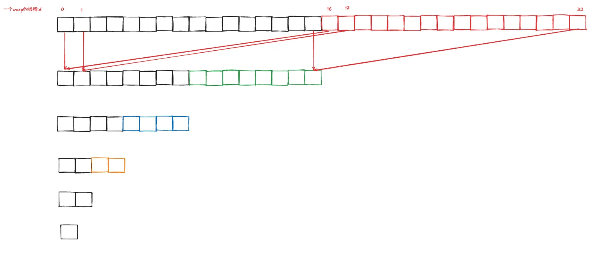

# 接口

```c
void layer_norm(torch::Tensor& out, torch::Tensor& input, torch::Tensor& gamma,
                torch::Tensor& beta, int num_tokens, int hidden_size,
                double epsilon);
```

# 参数说明

- out: 输出tensor, type: torch::Tensor, shape: [num_tokens, hidden_size]
- input: 输入tensor，type: torch::Tensor, shape: [num_tokens, hidden_size]
- gamma: 输入, 用于对layer normalization后的tensor进行scale, shape: [hidden_size]
- beta: 输入，用于对layer normalization后的tensor进行shift, shape: [hidden_size]
- num_tokens: NLP语境下为输入的token数，CV语境下为batch_size * channel
- hidden_size: NLP语境下为token的特征维数，CV语境下为feature map的height * width

# 功能

实现layer normalization。对于一个shape为$ m \times n $的输入tensor，layer normalization会对该输入tensor进行如下变换:

$$\mu_i = \frac{\sum_{j=1}^{n} x_{ij}}{n}; \sigma_i^2 = \frac{\sum_{j=1}^{n}(x_{ij}-\mu_i)^2}{n}\\
y_{ij} = \gamma_j\frac{x_{ij} -\mu_i}{\sqrt{\sigma_i^2 + \epsilon}} + \beta_j $$

# 实现细节

## 任务划分

不同Compute Capability的GPU下，虽然SM数及每个SM最多可以支持的线程块不太一样，但每个线程块几乎都是最多只能支持1024个线程。以A100为例：

- A100有108个SM, 每个SM最多支持32个线程块
- 每个 SM 有 64 个 Warp 调度器，因此最多可以调度 64×32 = 2048 个线程
- 每个线程块最多可以有 1024 个线程，如果线程块过大，可能会限制每个 SM 上的线程块数量，因为需要考虑硬件资源(寄存器、共享内存等)的分配

layer_norm按照以下规则进行任务划分:

1. 将tokens均分到各线程块进行处理
2. 将一个token的hidden_size个元素均分给一个线程块里的线程进行处理

## warp内线程的规约操作

```c
__device__ float warpReduceSum(float val) {
    // Warp 内规约
    for (int offset = warpSize / 2; offset > 0; offset /= 2) {
        val += __shfl_down_sync(0xFFFFFFFF, val, offset);
    }
    return val;
}
```

- warpSize: `CUDA`中的预定义常量，表示Warp的大小，通常是`32`
- offset:
    1. 初始值为`warpSize / 2`, 表示规约的步长
    2. 每次循环后，offset减半(offset /= 2), 直到offset为 0
- __shfl_down_sync:
    1. CUDA 提供的一个函数，用于在线程之间交换数据
    2. 函数原型: `T __shfl_down_sync(unsigned mask, T var, unsigned int delta)`, mask表示参与规约的线程(`OxFFFFFFFF`表示所有线程都参与), var表示线程中参与规约的值, delta表示与当前线程相距为delta的线程中的值进行规约操作

规约规程如下:
- 初始时，每个线程的`val`是局部值
- 每次循环，线程与相距`offset`的线程交换数据并累加
- 最终，Warp内的所有线程的`val`值会被规约为一个全局值（即所有线程的`val`之和）

||
|:---------------------------------------------------------------:|