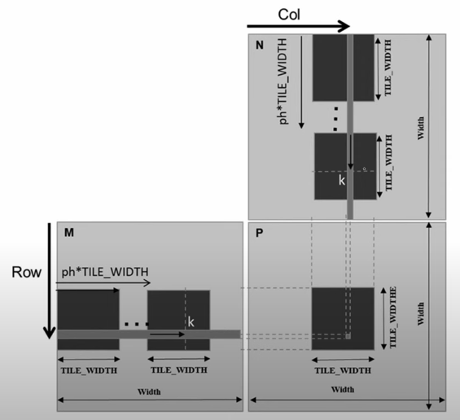
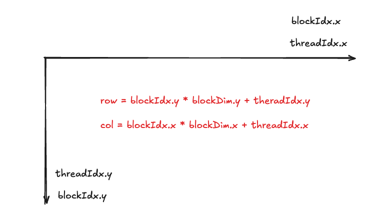

# 接口
```c
torch::Tensor matmul(torch::Tensor& a, torch::Tensor& b);
```
# 参数说明
* a: 进行矩阵乘法的第一个矩阵, shape = [m, k]
* b: 进行矩阵乘法的第二个矩阵, shape = [k, n]
* 返回值: 矩阵乘法的结果

# 功能
实现矩阵乘法:
$$C=AB$$.

目前支持的数据类型:
|A|B|C|
|---|---|---|
|float|float|float|

# 实现细节
## shared memory and tiling
* 动机: shared memory是on-chip memory, 访问速度比global memory快. GPU Kernel优化的一个要点就是要充分利用shared memory, 减少对全局内存的访问次数。
* 数学基础: 分块矩阵乘法
* 映射关系: one tile ---> one thread block





Q: 一个tile的height和weidth应该如何确定?
A: 通常需要结合具体的硬件架构进行考虑, 考虑的因素主要有:
1. shared memory的大小: 通常在几十KB和几百KB之间(每个SM)
2. 线程块的大小: 每个线程块的最大线程数通常是1024
3. bank conflict的考虑
4. 占用率(occupancy)的考虑: 占用率是指每个SM上活跃的线程束(thread warp)数量与SM支持的最大线程束数量的比值, 它反映了SM的并行计算资源利用率, 是优化CUDA程序性能的重要指标

## others
* `CUDA_LAUNCH_BLOCKING`: Force synchronous computation. An environment which is helpful for debugging
* `extern __shared__ float sm[]`: `extern`关键字在CUDA中用于声明动态分配的shared memory, 静态分配的shared memory不需要使用。可以参考[Using Shared Memory in CUDA C/C++](https://developer.nvidia.com/blog/using-shared-memory-cuda-cc/)